# The 5 AM Club - Robin Sharma

## Reglas de 5 AM Club

1. **An addiction to distraction is the end of your creative production.** Empire-makers and history-creators take one hour for themselves before dawn, in the serenity that lies beyond the clutches of complexity, to prepare themselves for a world-class day.
2. **Excuses breed no genius.** Just because you haven’t installed the early-rising habit before doesn’t mean you can’t do it now. Release your rationalizations and remember that small daily improvements, when done consistently over time, lead to stunning results.
3. **All change is hard at first, messy in the middle and gorgeous at the end.** Everything you now find easy you first found difficult. With consistent practice, getting up with the sun will become your new normal. And automatic.
4. **To have the results The Top 5% of producers have, you must start doing what 95% of people are unwilling to do.** As you start to live like this, the majority will call you crazy. Remember that being labeled a freak is the price of greatness.
5. **When you feel like surrendering, continue.** Triumph loves the relentless.

## Perspectiva para tomar acerca del dinero, la fama, etc

> Enjoy them, just don’t get attached to them. Have them, just don’t base your identity around them. Appreciate them, just don’t need them.

## 2 x 3 x Mindset

- to double your income and impact, triple your investment in two core areas—your personal mastery and your professional capability.

## The 3 step success formula

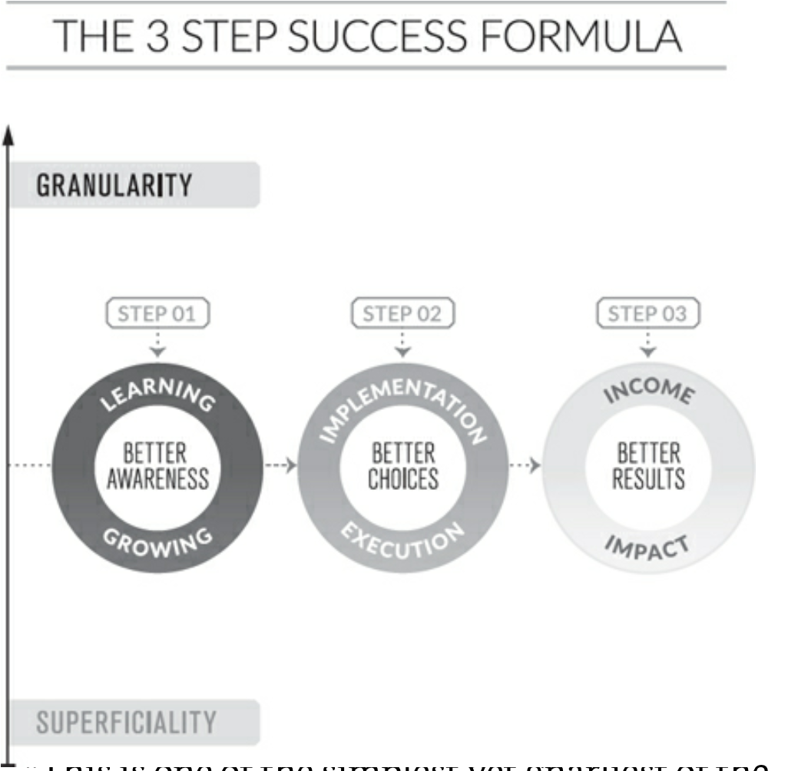

## En lo que todo se basa

> Tiny, daily wins and iterations stack into outcomes of excellence, over the long-term.

## La muerte y el club de las 5 am

Thinking about dying brings what matters most into much sharper focus.

## History Maker focuses

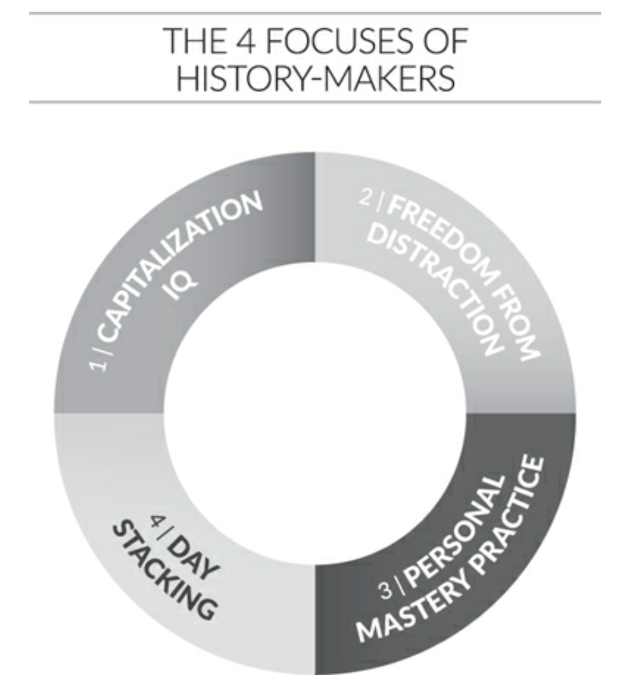

1. what makes a legendary performer so good isn’t the amount of natural talent they are born into but the extent of that potential they actualize—and capitalize.
2. Concentrate en menos cosas para poder ser outstanding en ellas
3. Practica diariamente tus skills: a performer must invest at least two hours and forty-four minutes of daily improvement on their chosen skill for ten years.
4. Haz esfuerzos del 1% cada día para ser el mejor en el futuro

## Secret of morning genious

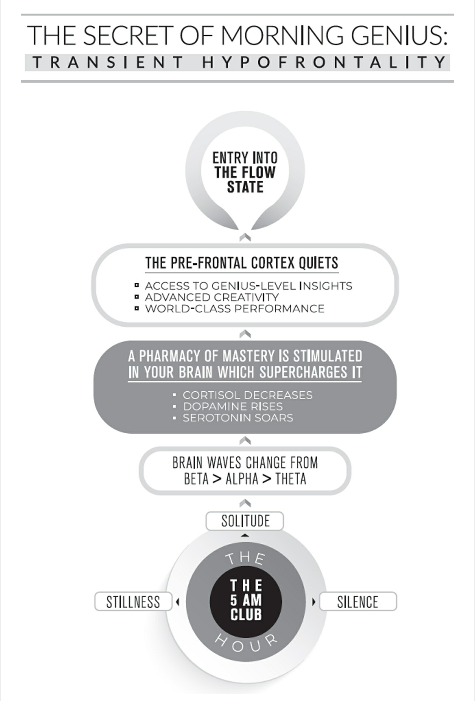

## 4 Interior empires

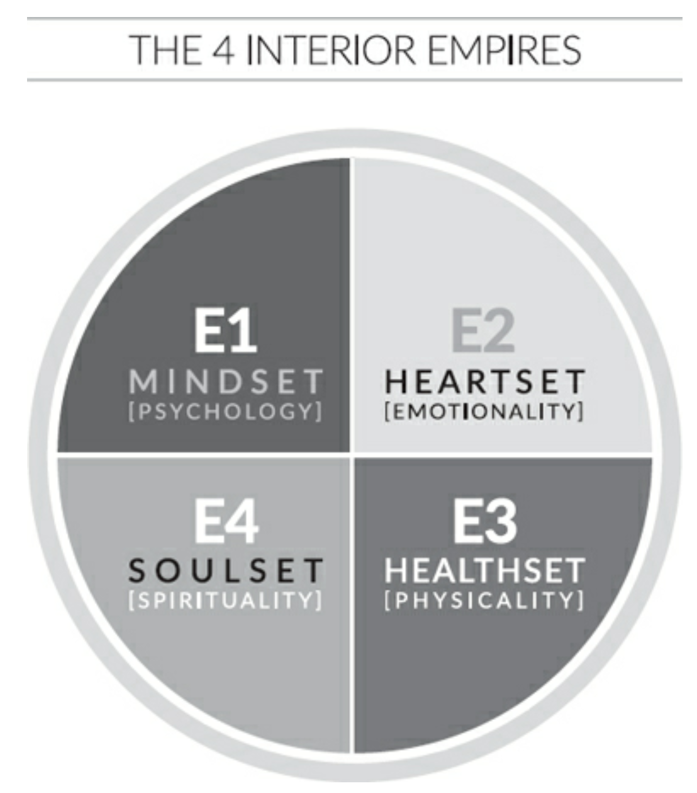

## 5-3-1 Creed of the Willpower Warrior

### 5 Scientific Truths Behind Excellent Habits

1. **World-class willpower isn’t an inborn strength, but a skill developed through relentless practice.** Getting up at dawn is perfect self-control training. 
2. **Personal discipline is a muscle. The more you stretch it, the stronger it grows.** Therefore, the samurais of self-regulation actively create conditions of hardship to build their natural power.
3. **Like other muscles, willpower weakens when tired. Recovery is, therefore, absolutely necessaryfor the expression of mastery.** And to manage decision fatigue.
4. **Installing any great habit successfully follows a distinct four-part pattern for automation of the routine.** Follow it explicitly for lasting results.
5. **Increasing self-control in one area of your life elevates self-control in all areas of your life.** This is why joining The 5 AM Club is the game-changing habit that will lift everything else that you do.

### The 3 values of Heroic Habit-Makers

1. Victory demands consistency and persistency.
2. Following through on what is started determines the size of the personal respect that will be generated.
3. The way you practice in private is precisely the way you’ll perform once you’re in public.

### The 1 General Theory of Self-Discipline Spartans

To regularly do that which is hard but important when it feels most uncomfortable is how warriors are born.

## Secret of success

The secret of success of every man and woman who has ever been successful—lies in the fact that they formed the habit of doing things that failures don’t like to do.’”

## Brain way of working

- The brain does what you are thinking constantly, you have the power to materialize whatever you believe in
- Neglect your power long enough and you’ll eventually believe you don’t have any.
- The more we practice a new habit the more our brains will work with us and evolve to make it part of who we are.

## Lifetime habit arc

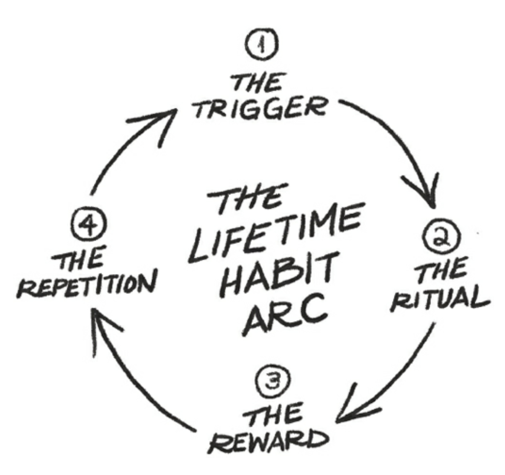

## Rewards

- Es importante premiarte por tus esfuerzos diarios
- Puede ser con un chocolate, con una siesta, o con lo que sea

## Habit instalation protocol

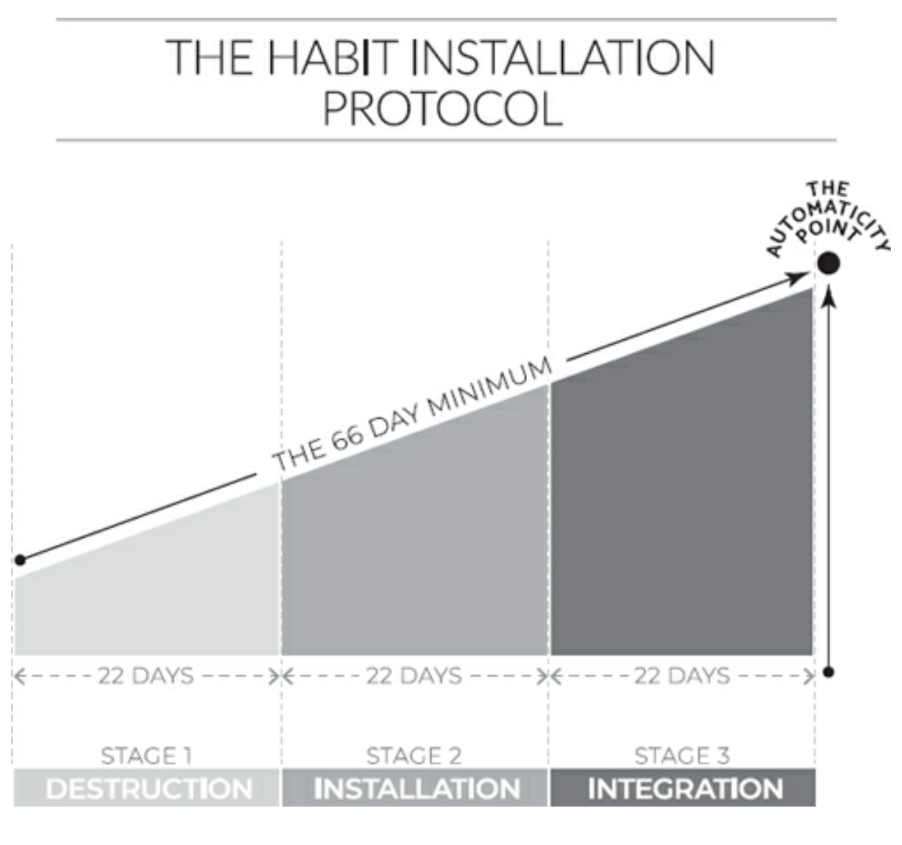

- Destruction:
  - Quitas los hábitos malos antes de poder poner los buenos
- Installation:
  - Se vuelve más difícil porque son las foundations del buen hábito
  - Then continue through the formation of new circuitry in your brain, which happens through neuroplasticity and the manufacturing of better pathways in your emotional core in stage two.
- Integration:
  - Tu nuevo hábito se convierte en lo normal para ti

### La magia

Here’s the real gift from your excellence and devotion over the sixty-six or so days: the willpower you were using to lay down the early-rising habit is now freed up for another world-class behavior.

### Death rebirth cycle

Cada vez que creas un nuevo hábito tu cerebro sufre mucho, pero una vez que lo tienes hecho un hábito ya no te quita nada y puedes pasar a tu siguiente hábito

### Tips para habits

1. To make a habit last, never install it alone.
2. The teacher learns the most.
3. When you most feel like quitting is the time you must continue advancing.

## 20/20/20 Formula

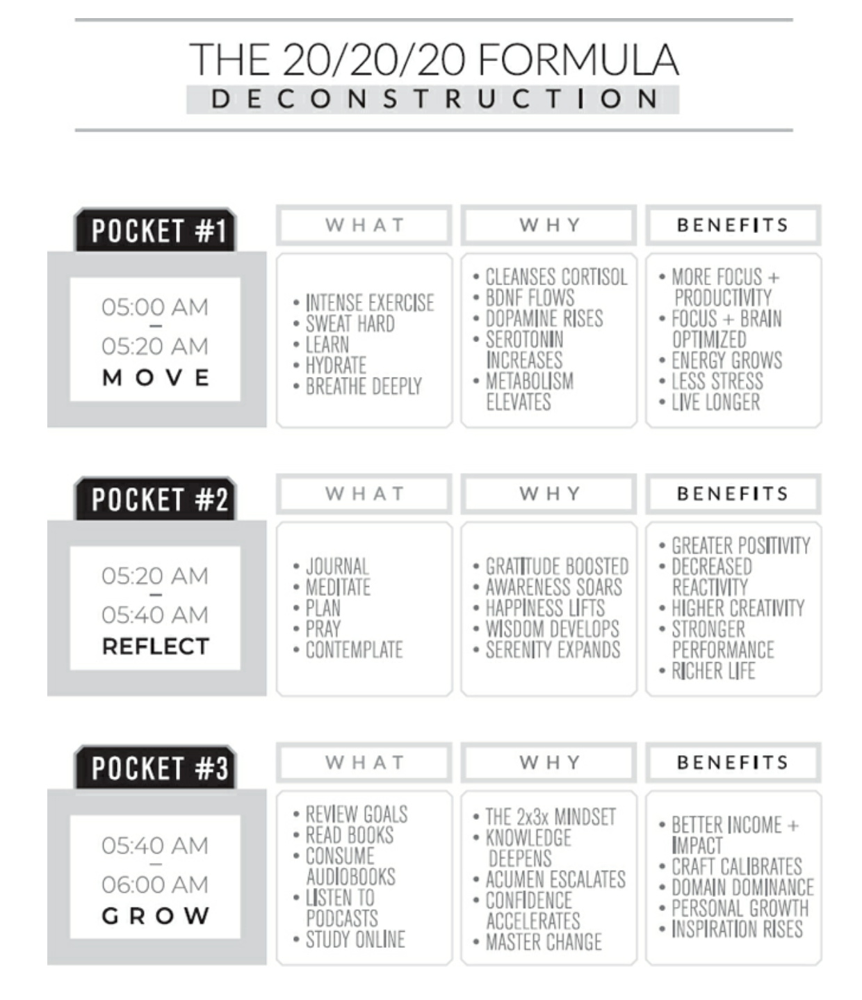

### First Pocket

‘You must begin your day with intense exercise. This is a non-negotiable. Otherwise The 20/20/20 Formula won’t work. And I’ll take back your membership in The 5 AM Club.’”

### Second Pocket

- During this twenty-minute segment of The Victory Hour, all you need to do is get serene, stay silent and enter the stillness.
- So, yes, you should also use the reflection pocket to invent, visualize and dream.

#### Preperfomance Blueprint

The Spellbinder calls a Pre-Performance Blueprint. This is simply a written statement of your ideal day ahead. Researchers confirm that pre-commitment strategies work beautifully to increase your focus and discipline to get things done. You’ll have a clear and calibrated script for your day ahead, so it unfolds the way you want it to.

### Journaling Habit deconstruction

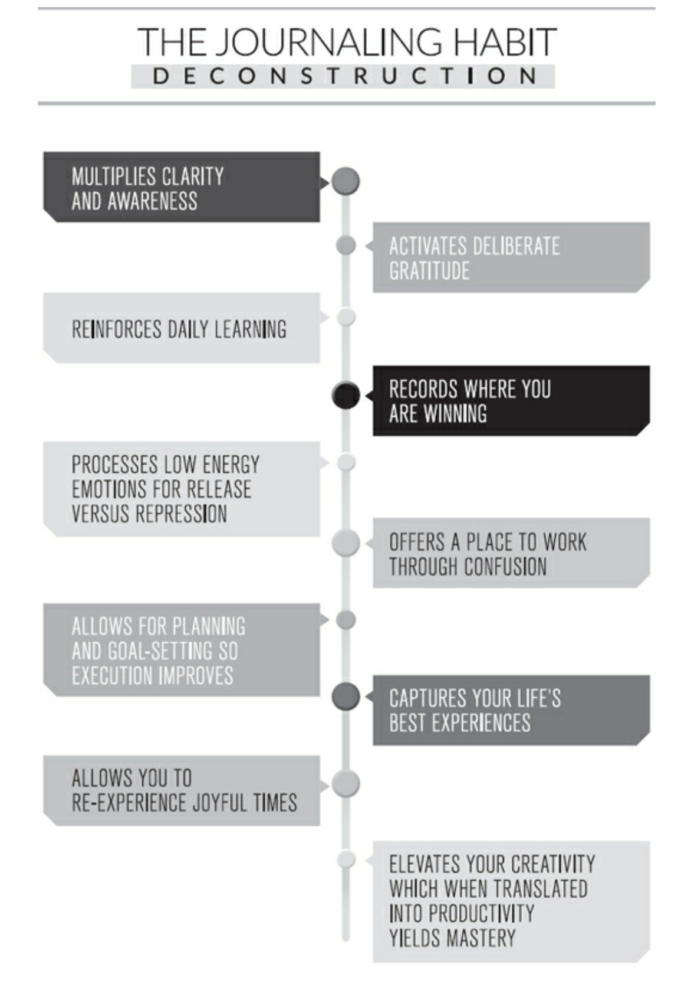

Simply download your commitments for the hours ahead, record your precious ambitions and activate your gratitude by listing what’s good in your life right now. Please also use your journal as a place to process through any frustrations, disappointments and resentments in your heart so you let them go.

### Third  Pocket

- Aprende algo nuevo en estos 20 minutos
- Each day acquire something that will fortify you against poverty, against death, indeed against other misfortunes as well; and after you have run over many thoughts select one to be thoroughly digested that day.
- We magnetize ourselves to excellent rewards by raising the value of our selves.

## Balance 

- “What makes genius-level performance is a delicate balance between the mastery of your morning routine and the optimization of your nightly ritual."
- 7 horas y medio mínimo de sueño cada noche

### Pre-sleep ritual

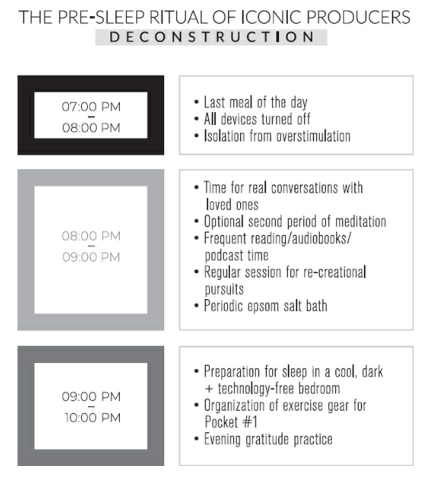

## Amazing day deconstruction

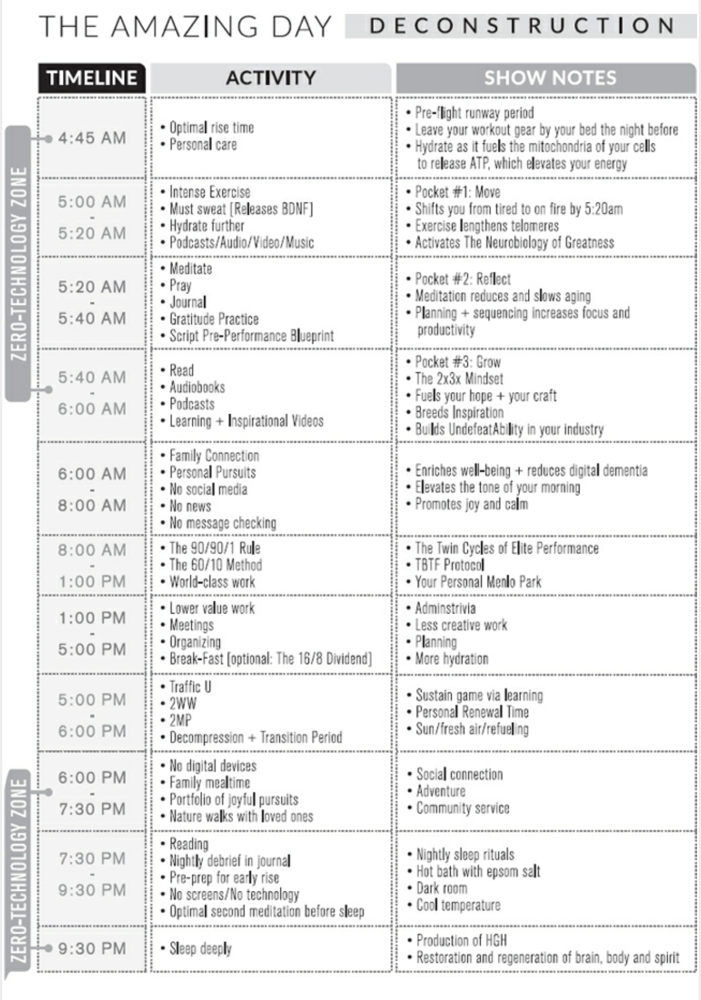

## 10 Tactics for lifelong genius

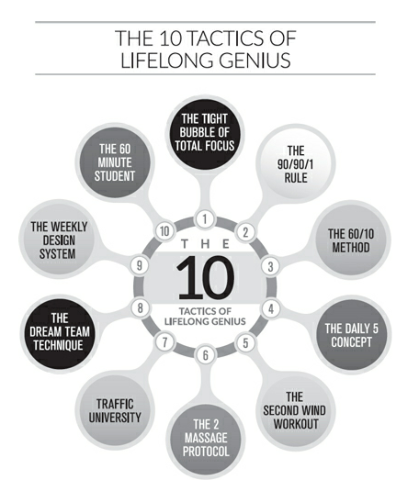

### The Tight Bubble of Total Focus (TBTF)

- Insight:
  - The addiction of dstraction is the death of your productivity
- Implementaion:
  - Crea tu propia burbuja libre de distracciones en tu día, busca como quitar distracciones continuamente

### The 90/90/1 Rule

- Insight:
  - Doing real work versus artificial work, daily and with absolute consistency, will give you a Gargantuan Competitive Advantage born of mastery. Productivity of virtuoso-level quality is rare. And the marketplace pays most for something that is scarce. Legendary achievers concentrate all their attention and effort on one core project at a time so they harness the fullness of their cognitive capacity and their precious energy on releasing glorious products that turn their industry on their head.
- Implementation:
  - For the next ninety days, schedule yourself to invest the first ninety minutes of your workday on the one activity that, when completed at world-class, will cause you to own your field.

### The 60/10 Method

- Insight:
  - La atención oscila por lo que tienes que descansar cada cierto tiempo
- Implementatoin:
  - After you’ve run the 90/90/1 segment of your workday, use a timer and work at your best for sixty minutes straight while sitting or standing quietly, in your Tight Bubble of Total Focus. Train yourself not to move. Just concentrate. And create the highest results you can possibly make. After your sixty-minute productivity sprint is done, refuel for ten minutes. Ideas for this recovery cycle include going for a quick walk in fresh air, reading a book that will advance your leadership or personal mastery, meditating, visualizing or listening to energizing music with headphones on like many championship athletes do before they step onto the court, so that their brain’s attention shifts from the ruminating and worrying behaviors of the left hemisphere into the creativity and flow of the right section. After ten wonderful minutes of regeneration, go back and perform your next sixty-minute work segment, full of inspiration, excellence and ingenuity. And then your next ten-minute cycle of renewal.

### The Daily 5 Concept

- Insight:
  - Los grandes siempre se enfocan en pequeñas metas cada día que con el tiempo los vuelve increíbles
- Implementation:
  - During the second pocket of your Victory Hour, list the five tiny targets you wish to accomplish over the day ahead for you to feel it was one well-spent.

### The 2nd Wind Workout (2WW)

- Insight: 
  - Ya uqe el ejercicio le hace tanto bien a tu cuerpo porque solo hacer los primero 20 minutos de tu día?
- Implementation:
  - Ten un second workout al final de tu día

### The 2 Massage Protocol (2MP)

- Insight: 
  - Studies have demonstrated that massage therapy is a modality that generates significant improvements in brain performance, mood, your ability to fight stress, and in terms of your general wellness.
- Implementation:
  - To apply The 2MP, lock two ninety-minute massages onto your weekly schedule.

### Traffic University

- Insight:
  - Se pierde mucho tiempo cuando te trasladas y eso lo puedes aprovechar para aprender algo
- Implementation:
  - escucha un audiolibro o un podcast

### The Dream Team Technique

- Insight:
  - Professional athletes structure a full team to support their rise to Best in World (BIW). In this way, they are freed up to marshal their five assets of genius around the development of the expertise and powers that will cause them to become dominant at their sport.
- Implementation:
  - Delegate tasks that not only are a poor use of your hours but also diminish your happiness. Ideally, restructure your entire life so you’re doing only the things you’re great at—and love to do.

### The Weekly Design System (WDS)

- Insight:
  - Tener un schedule de la siguiente semana te ayuda a balancear tus actividades
- Implementation:
  - Empieza haciendo un review de los highlights de la semana pasada en tu journal
  - Escribe qué aprendiste y qué puedes optimizar para que la próxima semana sea mejor
  - Pon tus actividades siguiedo los 90/90/1 sessions y os 60/10 sesions junto con los 2ww

### The 60 Minute Student

- Insight:
  - The more you knwo the better you'll do
- Implementation:
  - Aparte 60 minutos de tu día para aprender algo tú

## Twin cycle of elite performance

## Mantras

> "Today is a glorious day and I’ll live it at excellence, with boundless enthusiasm and limitless integrity, true to my visions and with a heart full of love."

> "Be grateful for every moment. Don’t be timid when it comes to your ambitions. Stop wasting time on insanely trivial things. And make it a priority to reclaim the creativity, fire and potential that is dormant within you."

> “I am grateful. And I am forgiving. I am giving. My life is beautiful, creative, productive, prosperous and magical.”

> “Stop managing your time and start managing your focus,”

> “I don’t wish for an easy life because there is no growth of my powers there. Give me a challenging life—one that brings out the finest in me. For this makes an iron will. And an unconquerable character."

> Daily discomfort is the price of enduring success.

> “The single best way to build your willpower is to voluntarily put yourself into conditions of discomfort."

> “The reasonable man adapts himself to the world: the unreasonable one persists in trying to adapt the world to himself. Therefore, all progress depends on the unreasonable man.”

> "Legendary performers practice being spectacular for so long that they no longer remember how to behave in non-spectacular ways."

> "We make our worst decisions and our lowest choices when we’re exhausted. So, don’t allow yourself to get exhausted."

> "When faced with a choice, always choose the one that pushes you the most, increases your growth and promotes the unfoldment of your gifts, talents and personal prowess."

> "Memento homo" is Latin for ‘remember you are only a man,’. Elimina la arrogancia porque eres igual a cualquier otro

> ‘If we could change ourselves, the tendencies in the world would also change. As a man changes his own nature, so does the attitude of the world change toward him. We need not wait to see what others do.’

> “Everyone dreams of being a legend until it comes time to do the work that legends do.”
